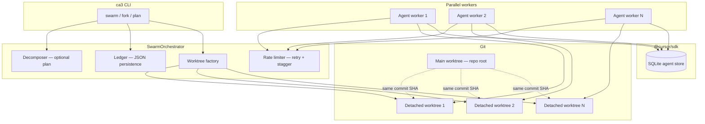

# Architecture — Cursor Claw · swarm orchestration & SDK

> **Canon** · **Cursor Claw** [`cursor-calw`](https://github.com/kariemSeiam/cursor-calw) · npm [`cursor-calw`](https://www.npmjs.com/package/cursor-calw) · [pigo.dev](https://pigo.dev) · MIT · docs follow [`Editorial covenant`](./README.md#editorial-covenant).

This document describes how **multi-agent swarm** (`ca3` / `SwarmOrchestrator`) fits with [**`@cursor/sdk`**](https://www.npmjs.com/package/@cursor/sdk): task flow, **Git worktrees**, SQLite (**SDK agent store**) versus **JSON ledger** on disk.

**You are reading:** internals — diagrams, durability boundaries, orchestrator constants.

---

## High-level system design

- **Entry point:** `ca3` commands (`swarm`, `fork`, `plan`, `resume`, `review`, `integrate`, etc.) construct a `SwarmOrchestrator` and run tasks.
- **Orchestration:** Task text (or explicit task specs) → optional **decomposition** → **ledger** writes → **worktrees** → **agents** with **staggered batches** and **retries**.
- **Integration (optional):** After workers finish, an **integrator** can merge results via a dedicated integration worktree (see `integrator.mjs`).

---

## Components

| Layer | Role |
|--------|------|
| **`src/ca3.mjs`** | CLI, argument parsing, ephemeral **swarm state** under `.tmp-cli/swarm-state.json` (paths for review/integrate after a run). |
| **`src/lib/swarm.mjs`** | `SwarmOrchestrator`: plan vs. simple mode, ledger lifecycle, worktree creation, `batchWithStagger` dispatch, optional integrator, cleanup. |
| **`src/lib/decomposer.mjs`** | Leader agent produces a **JSON DAG** of subtasks (`description`, `scope`, `allowed_paths`, `dependencies`). |
| **`src/lib/worktrees.mjs`** | `git worktree add --detach` into OS temp under `claw-swarm`, diff/stat helpers, orphan cleanup. |
| **`src/lib/ledger.mjs`** | Crash-oriented **JSON** state: `.claw-swarm/ledger.json` in the repo. |
| **`src/lib/rate-limiter.mjs`** | `withRetry` (429/464/5xx), `batchWithStagger` (concurrency + delay between batches). |
| **`src/lib/reviewer.mjs`** | Cross-worktree **overlap detection** on changed files (merge conflict preview). |
| **`src/lib/integrator.mjs`** | Applies worker diffs into an integration worktree and can merge back to the main repo. |
| **`@cursor/sdk`** | `Agent.create({ apiKey, model, local: { cwd } })` — each worker’s `cwd` is its **worktree path**. |

---

## End-to-end data flow

### 1. Planning (optional)

When `usePlan` is true (`swarmWithPlan` or `ca3 swarm ... --plan`):

1. A **leader** agent runs in the **main repo** (`local.cwd` = repo root) and returns a validated JSON array of tasks.
2. Each task becomes a **worker spec** (description, scope, paths, dependencies). Dependencies define a **DAG**; the ledger can represent `blocked` vs. `queued` tasks for future dependency-aware execution.

### 2. Ledger creation

- `Ledger.createSwarm()` initializes `.claw-swarm/ledger.json` with task rows, options (model, retries, integrator flag), and `status: "running"`.
- On **simple swarm** mode, each worker row mirrors one parallel copy of the same task string.
- The file is rewritten after major phases (worktree paths, completion).

### 3. Worktree creation

- `createWorktrees(repo, branch, count)` resolves **`HEAD`** to a commit SHA and runs **`git worktree add --detach <path> <sha>`** for each worker.
- Paths live under **`$TMPDIR/claw-swarm/`** (see `WORKTREE_BASE` in `worktrees.mjs`), with unique names (`timestamp`, index, short UUID).
- **Detached** checkouts avoid tying workers to a shared branch tip and reduce interference with the primary worktree’s branch.

### 4. Agent execution

- Each worker gets `Agent.create({ ..., local: { cwd: worktree.path } })`.
- The SDK streams tool events; Swarm collects **changed files**, **diff stats**, and success/failure.
- **Batching:** `batchWithStagger` runs up to `concurrency` agents in parallel, waits `staggerMs` between batches (default stagger **2000 ms** in `swarm.mjs`) to reduce API thundering herds.
- **Retries:** Agent creation uses `withRetry` from `rate-limiter.mjs`.

### 5. Results and cleanup

- Results are written back to the ledger via `markTaskDone`.
- If `autoCleanup` is enabled (default), `removeAllWorktrees` runs; otherwise paths remain for `ca3 review` / `ca3 integrate`.
- **Orphan** worktrees under `WORKTREE_BASE` can be listed and removed with `cleanupOrphanedWorktrees` (used by `ca3 clean`).

---

## Worktree isolation model

| Concern | How isolation works |
|---------|---------------------|
| **Filesystem** | Each agent only has the worktree directory as SDK `cwd`; edits do not appear in sibling worktrees until merged or copied. |
| **Git state** | All worktrees share the same object database (same repo), but **separate** working trees and **separate** `HEAD` (detached at the same commit initially). |
| **Branch contention** | Detached HEAD avoids multiple worktrees checking out the same branch name. |
| **Drift** | Workers start from the **same** SHA; any divergence is **local diff** until integrated. |

**Conflict surface:** Two workers modifying the **same file path** yields overlapping changes; `reviewer.mjs` flags shared paths for manual merge ordering.

---

## SQLite, agent store, and “deduplication”

Two different persistence mechanisms appear in this stack:

### 1. Cursor SDK — SQLite agent store (under the hood)

As documented in [REVERSE_ENGINEERING.md](./REVERSE_ENGINEERING.md), the SDK maintains state in **SQLite** under:

`~/.cursor/sdk-agent-store/<hash>/`

- The **hash-scoped** directory isolates persisted SDK data (runs, caching, identifiers) per workspace/store identity.
- From an architecture standpoint, treat this as **SDK-internal**: sessions, deduplicated or reused artifacts, and bookkeeping the CLI does not manage directly. Multiple agents on one machine each use the SDK’s storage through `Agent.create`; **this repo never reads that SQLite directly.**

**Why “deduplication” matters in practice:** A stable hash bucket lets the SDK **reuse** or **deduplicate** persisted agent-side state instead of growing unbounded duplicate rows for the same logical workspace key. You typically do not configure this from `ca3`; you ensure **correct API keys**, **disk space**, and **reasonable parallelism** so the store stays healthy.

### 2. Cursor Claw JSON ledger (not SQLite)

Swarm’s **durable run state** for recovery is **`.claw-swarm/ledger.json`** — plain JSON written by `Ledger.save()`, not SQLite.

- **Dedup at the ledger layer** is **not** file-content hashing; it is **process-oriented**: one ledger per run, tasks keyed by index, worktree paths stored once per task row.
- For **Git-level** deduplication of **blobs/objects**, normal Git mechanics apply (shared `.git/objects` across worktrees).

---

## Limits baked into the orchestrator

| Constant | Typical role |
|----------|----------------|
| `MAX_WORKERS` (5 in `swarm.mjs`) | Upper bound on parallel workers per orchestrator instance. |
| `BATCH_STAGGER` (2000 ms) | Delay between concurrent batches to ease rate limits. |
| Decomposer `maxTasks` | Caps planner output size (CLI `plan` uses parsed worker count or default). |

---

## Related docs

- [docs/README.md](./README.md) — TOC + editorial covenant.
- [swarm-patterns.md](./swarm-patterns.md) — when to use swarm vs. fork vs. plan; scaling heuristics.
- [troubleshooting.md](./troubleshooting.md) — errors, Git repair, rate limits.
- [API_REFERENCE.md](./API_REFERENCE.md) — Cursor HTTP / ConnectRPC catalog (broader project appendix).
